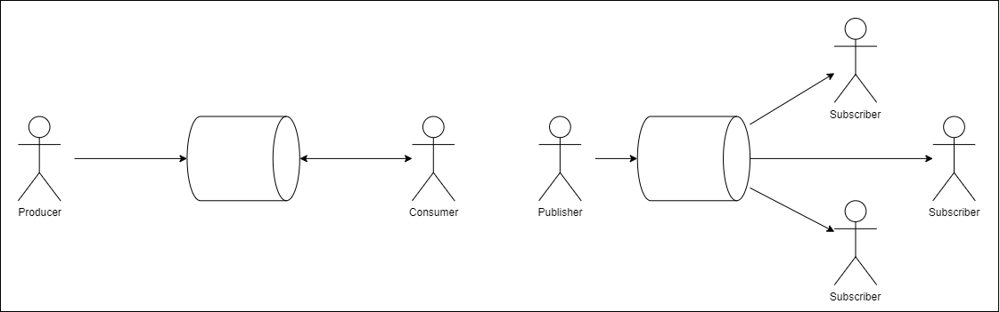

<!-- _class: title -->

# MQ Introduction

## Understanding from Scratch
## Message Queuing

---

## Table of Contents

1. What is Message Queuing
2. Why Use Message Queuing
3. Leading Message Queuing Systems
4. Sample of Message Queuing
5. Use Cases of Message Queuing
6. Conclusion

---

<!-- _class: section_title -->

## 1. What is Message Queuing

---

## What is Message Queuing

- Message queuing is a mechanism to put messages into a queue and retrieve them later.
- It is also called asynchronous messaging, and with the rise of microservices architecture, catching up is essential.
- There are two patterns: Publish/Subscribe and Producer/Consumer

---

## Patterns of Message Queuing

### Publish/Subscribe

- The sending side is called the Publisher and the receiving side is called the Subscriber.
- The Publisher only sends messages, while the Subscriber only receives them.
- It becomes a one-to-many relationship.

### Producer/Consumer

- The sending side is called the Producer and the receiving side is called the Consumer.
- The Producer sends a message and the Consumer returns an acknowledgement (ack) upon receipt.
- It becomes a one-to-one relationship.

---

## Patterns of Message Queuing

---

<!--_class: section_title-->

## 2. Why Use Message Queuing

---

## Reasons to Use Message Queuing

The reasons to use message queuing include:

- Programs become loosely coupled.
- Parallelization of program processes.
- Distribution of program processes.

The last two reasons often become essential when building large-scale systems, which is why many cloud vendors offer message queuing.

---

<!--_class: section_title-->

## 3. Leading Message Queuing Systems

---

### RabbitMQ

- A message queuing system implemented in Erlang.
- Adopts the AMQP (Advanced Message Queuing Protocol).

### Apache Kafka

- A message queuing system implemented in Scala.
- Uses its own messaging protocol.

---

### Apache ActiveMQ

- A message queuing system implemented in Java.
- Adopts the JMS (Java Message Service).
- Also has a next-generation version called Artemis.

### Amazon SQS

- A message queuing system offered by AWS.

Incidentally, AWS also offers AmazonMQ, RabbitMQ, and ActiveMQ as separate services.

---

### Google Pub/Sub

- A message queuing system offered by GCP.

### Azure Service Bus

- A message queuing system offered by Azure.
- Adopts AMQP.

---

<!--_class: section_title-->

## 4. Sample of Message Queuing

---

### 4. Sample of Message Queuing

For this sample of message queuing, we created a chat application.

It can be downloaded from the following repository:

https://github.com/memenashi/rabbitmq-chat-system

---

## 4. Sample of Message Queuing

- Utilized the Pub/Sub pattern for chats.
- Utilized the P2P pattern for direct messages.

### Key Points

- In the P2P pattern, if there are multiple Consumers, they receive messages in rotation.
- In the Pub/Sub pattern, even if there are multiple Subscribers, all Subscribers receive messages.

---

<!--_class: section_title-->

## 5. Use Cases of Message Queuing

---

## 5. Use Cases of Message Queuing

### Nulab

Used for communicating organizational information managed by Nulab Apps between services.

https://nulab.com/ja/blog/nulab/jobqueue-messagequeue/

### ZOZO

ZOZO's cart system uses message queuing.

https://techblog.zozo.com/entry/production-ready-zozotown-cart-queueing-system

---

<!--_class: section_title-->

## 6. Conclusion

---

## 6. Conclusion

- Message queuing is a mechanism to enqueue messages and retrieve them later.
- Reasons to use message queuing include programs becoming loosely coupled, parallelizing processes, and distributing processes.
- Leading message queuing systems include RabbitMQ, ActiveMQ, Amazon SQS, and Azure Service Bus.
- With the rise of microservices architecture, the value of message queuing is being reevaluated.